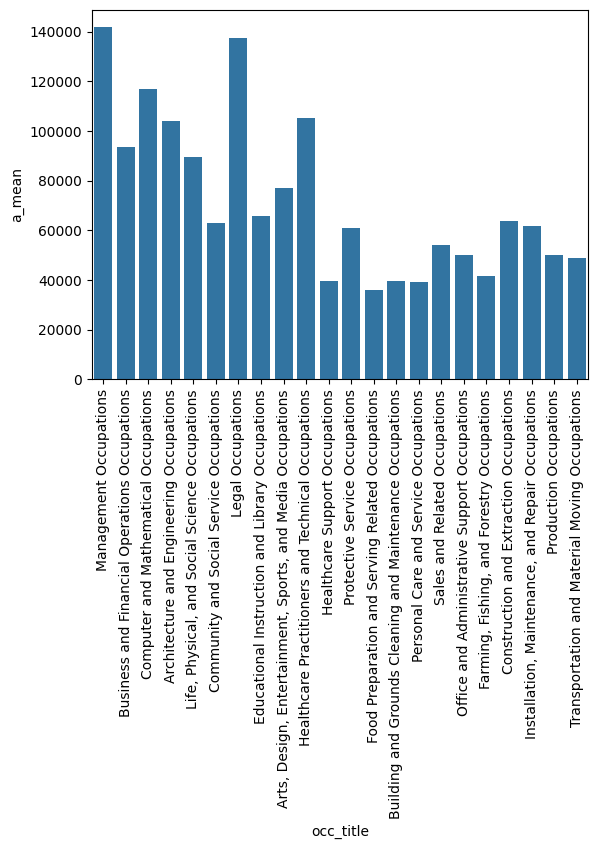
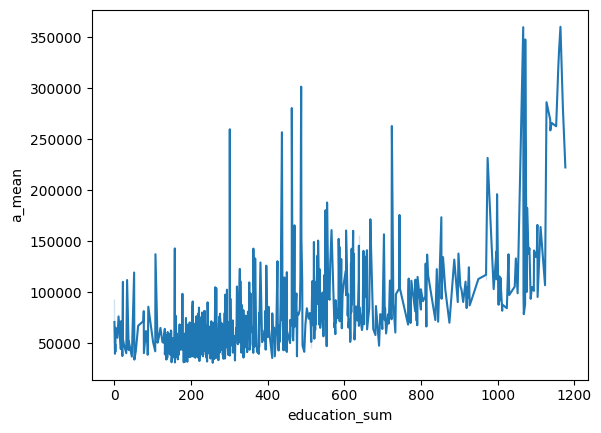
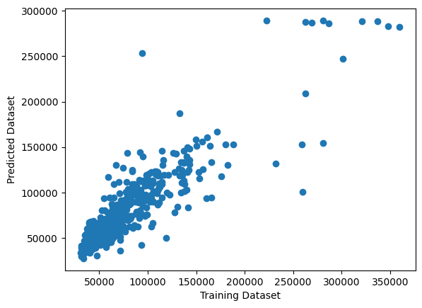
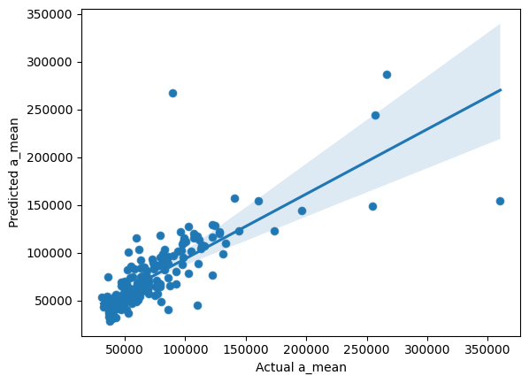

Documentation Report
====================

Comparing Educational Cost of Training to Occupational Outcome
--------------------------------------------------------------------

# Project Description

## Problem Identification

Job seekers face a challenge. The cost of training, both in terms of finances and time spent, varies widely across industries. Some types of training are expensive while others provide paid apprenticeships. The financial results of these training pathways vary widely in turn. The relationship between the investment and the return on that investment is not always apparent to a jobseeker. Without understanding this relationship, jobseekers may find themselves pouring their energy into a career pathway that will not provide them with a justifiable reward.

## Context

This research project intends to explore the relationship between investment required in a career-training program and the expected salary one can earn. Various cross-sections of research may be performed as a part of this project. For example, the project may compare overall training cost per industry against industry expected salaries. In another possible inclusion, the project may explore the amount of time it takes to train for any job, regardless of industry, and compare that against overall financial outcomes.

## Criteria for Success

The aim of the project is to show a broad spectrum of relationships between time and financial resources spent compared to the financial outcomes. The project will be deemed successful when it is able to show clearly and in visual format the requirements and rewards across a wide range of industries and situations. Several highlights will be provided from the resulting data. As the project develops and highlights are discovered, the project may deepen with a focus on those areas to provide insight to job seekers.  

## Scope of Solution Space

The solution space will focus on publicly available data, comparing known career-training requirements and salary expectations. Datasets will be downloaded locally and loaded into a PostgreSQL database. The data will be accessed via Jupyter Notebook, wrangled and cleaned using tools such as Pandas and Numpy, and the resulting metadata will be saved back into the PostgreSQL database.   
With the data cleaned, various types of analysis will be performed. Relationships between training time and cost will be explored across salary outputs, with various cross-sections performed according to industry and other features.  
With the relationships established, visualizations will be created. Seaborn and Matplotlib will be used as preliminary visualization tools.  
As time allows, the project may expand to include the use of tools such as Apache Superset and other professional-grade data-driven storytelling tools.  
The final output may be a shareable and downloadable PDF that contains informative slides and a project report. Additionally, as time allows, the project may include a downloadable Github project that allows for a small level of interactivity within an Apache Superset instance.

## Stakeholders

The target audience for this data exploration is prospective jobseekers. This presentation will be made available online as a resource that anyone can download or view for their personal benefit.   
Ideally, the dataset may provide insight for jobseekers who are deciding between various career paths and are still at a stage of career progression where this information can inform their decision-making process.

## Constraints

This exploration is constrained to existing datasets that are publicly available. The exploration is also constrained to limit the output according to what explorations and visualizations can be output by one individual working independently as an avocation, and within a reasonably short amount of time. 

## Data Sources

The primary two datasets that will be used for this exploration are the O\*NET and BLS Wage Data datasets. The datasets have joinable identifiers on occupational id types.

### O\*NET

The O\*NET dataset contains a collection of information about skill sets, training, education, and occupational information.  
[https://www.onetcenter.org/database.html\#all-files](https://www.onetcenter.org/database.html#all-files)

### BLS Wage Data

The BLS Wage Data dataset contains information about various industries and their associated expected salaries.   
[https://www.bls.gov/oes/](https://www.bls.gov/oes/) 

# Data Wrangling

Data was obtained from the above sources.

The data was originally in an unusable state and required significant wrangling. 

The files for viewing the data-wrangling process can be found in the `/notebooks/02-data-wrangling` directory of this project.

As the data was successfully wrangled, we inserted the data into the PostgreSQL databases.

Data was processed in stages, starting in its original form, then inserted into database schemas named for their stage of the wrangling process: `stage_00`, `stage_01`, and `stage_02`.

# Exploratory Data Analysis

We performed exploratory data analysis to get a better idea of the data.

## Observing Career Financial Outcomes in Isolation

The following image shows a general breakdown of career categories and their overall financial expectations.

The two highest career paths are Management and Legal Occupations.

## Comparing Educational Investment to Outcome

As an initial foray into the analysis, we compared educational investment levels to financial outcome.

In order to achieve this, we took the O*NET data that indicated the level of schooling survey respondents stated were necessary for success and cross-referenced them to the same categories of financial outcomes in the BLS wage data.

As shown in the chart, more education generally improved outcome, but the results were not entirely linear.

Some careers show exorbent returns early on in the growth path, while other careers require significant investment for only modest returns.

# Preprocessing, Training

We then pulled our data into a new notebook where we focused on preprocessing and training the data.

As a part of preprocessing, we created dummy variables for each of the `major` and `minor` career categories.

We used the `StandardScaler()` tool from scikit-learn to ensure the data was scaled properly.

We then split the data into training and test sets, and repeated this process for each model as needed.

# Modeling

The modeling stage took three different models into account.

- Linear Regression
  - This model had a `0.795` R^2 score
- Ordinary Least Squares
  - This model also had a `0.795` R^2 score
  - This model had an extremely high condition number, which is a sign of severe multicolinearity
  - Therefore, this model was deemed less effective than the Linear Regression Model
- Ridge Regression
  - This model produced an R^2 score of `0.601`
  - Because this R^2 score was substantially lower, this model is also not the ideal candidate

# Modeling and Visualization

Finally, with a model selected, we generated and plotted predictions.

The first visualization shows predictions plotted against actual values from the test dataset.

The second visualization includes a Linear Regression against actual values.

# Conclusion

There is a positive correlation between the value respondents place on higher levels of education and an increase in average annual salary.

However, while the linear-regression model is useful, there is not a definitive correlation.

This is logical, because some careers require skills that are difficult to teach, if not impossible. For example, CEOs require more than just mathematical learning; they require leadership, which is a truly difficult concept to translate into a classroom curriculum.

Another example can be found with sports athletes. Professional athletes make exorbant amounts of income, but may not need an education beyond high school.

Therefore, education does seem to have value overall, but it is not an ultimate factor in an individual person's earning potential.